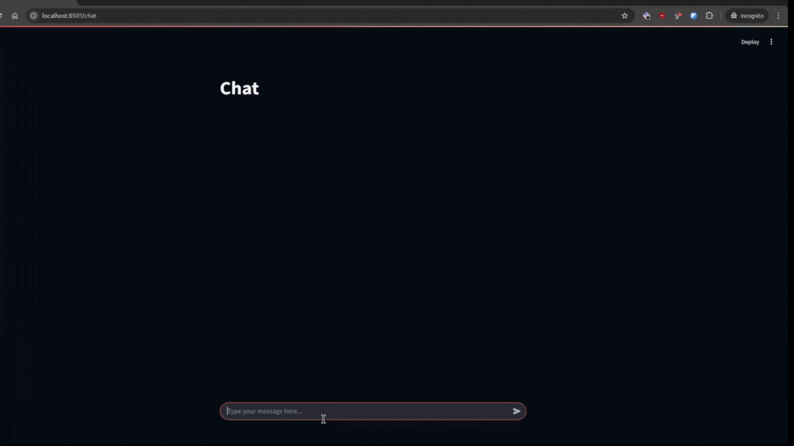

# Market Streamer

**Market Streamer** is a work-in-progress platform for accessing and analyzing market data. It supports both real-time and historical data, and is designed to help users make better decisions using technical analysis tools and AI-driven insights.

---

## Note

This project is still in development. This README is part of a public repository to share the concept and progress. The source code itself is in a private repository.  
If you're interested in the project, want to collaborate, or would like access to the code, feel free to contact me directly.
---

## Project Overview

The goal is to build a native application (with browser support via WebAssembly) that lets users do common market analysis tasks like charting, technical analysis, and backtesting. But the important part is the integration of an AI agent — an assistant that can understand natural language and interact with all parts of the system. Instead of just clicking through menus or writing code, users can also chat with the AI to supercharge their workflow and decision-making.

---

## Key Components

- **Backend API (Go):** Connects to exchanges, handles requests, and acts as the core middleware.
- **Data Processor (Python):** Performs calculations like RSI, moving averages, etc.
- **Queue System (Kafka):** Streams real-time and historical financial data between services for processing, analysis, and storage.
- **MCP + Agent (Python):** A natural language agent that helps users interact with the system and understand strategies.
- **Database (TimescaleDB):** Stores historical market data.
- **UI (C++ with Raygui):** Native interface for the app. Will be ported to the web using Emscripten and WASM.

---

## Current Progress

- The backend API is set up using Go and currently connected to Binance (chosen due to its free access). Support for more exchanges will be added later.
- Kafka is integrated to handle streaming of real-time and historical data between services.
- TimescaleDB is in place for storing and querying time-series market data.
- A data processing service in Python is running, which currently calculates RSI and simple moving averages using ticker data. It also supports basic backtesting using these indicators. These are just the initial technical indicators — more will be added over time.
- The Black-Scholes model is implemented for calculating option prices.
- The MCP-based agent (using Python) is working and can:
  - Fetch live and historical ticker data
  - Compute RSI and SMA
  - Run basic backtests
  - Calculate option prices using the Black-Scholes model
- A temporary UI is built using Streamlit to prototype features. It includes:
  - A dashboard to display indicator and backtest results
  - A chat interface for interacting with the AI assistant

Screenshots and demo videos of the current progress are included below.

---

## Media

### Dashboard Example

  
  
  
  

### Chat Interface with AI Agent

https://github.com/user-attachments/assets/e0b633cb-2d9e-4a0e-a489-802c55dcee11

https://github.com/user-attachments/assets/64ad3473-1da7-40a2-857a-319116671495

---

## Next Steps

- Begin development of the native C++ UI using Raygui
- Integrate additional exchanges and technical indicators
- Start preparing for web deployment using Emscripten and WebAssembly
